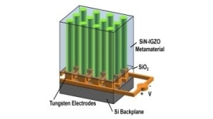

# Publications

## Journal papers

:::{list-table} Journal papers
:widths: 25 100
:header-rows: 0

*  - 
   - Tsang-Hsuan Wang[{fab}`orcid;sd-text-success`](http://orcid.org/0000-0002-7760-7500), 
Po-Chun Hsu[{fab}`orcid;sd-text-success`](http://orcid.org/0000-0003-0823-6088), 
Maxim Korytov, 
Jan Genoe[{fab}`orcid;sd-text-success`](http://orcid.org/0000-0002-4019-5979), 
Clement Merckling[{fab}`orcid;sd-text-success`](http://orcid.org/0000-0003-3084-2543), 
**[Polarization control of epitaxial barium titanate (BaTiO3) grown by pulsed-laser deposition on a MBE-SrTiO3/Si(001) pseudo-substrate]()**, 
Journal of Applied Physics 128, 104104 (September 2020), 
[DOI: 10.1063/5.0019980](http://dx.doi.org/10.1063/5.0019980)

*  - 
   - Tsang-Hsuan Wang[{fab}`orcid;sd-text-success`](http://orcid.org/0000-0002-7760-7500), 
Robert Gehlhaar[{fab}`orcid;sd-text-success`](http://orcid.org/0000-0002-3038-9462), 
Thierry Conard, 
Paola Favia, 
Jan Genoe[{fab}`orcid;sd-text-success`](http://orcid.org/0000-0002-4019-5979), 
Clement Merckling[{fab}`orcid;sd-text-success`](http://orcid.org/0000-0003-3084-2543), 
**[Interfacial control of SrTiO3/Si(0 0 1) epitaxy and its effect on physical and optical properties]()**, 
Journal of Crystal Growth 582, 126524 (March 2022), 
[DOI: 10.1016/j.jcrysgro.2022.126524](http://dx.doi.org/10.1016/j.jcrysgro.2022.126524)

*  - 
   - Guillaume Croes[{fab}`orcid;sd-text-success`](http://orcid.org/0000-0001-6168-9794), 
Renaud Puybaret[{fab}`orcid;sd-text-success`](http://orcid.org/0000-0002-4946-2658), 
Janusz Bogdanowicz, 
Umberto Celano, 
Robert Gehlhaar[{fab}`orcid;sd-text-success`](http://orcid.org/0000-0002-3038-9462), 
Jan Genoe[{fab}`orcid;sd-text-success`](http://orcid.org/0000-0002-4019-5979), 
**[Photonic Metamaterial with a Subwavelength Electrode Pattern](docs/PhotonicMetamaterial.pdf)**, 
Applied Optics 62,F14 (March 2023), 
[DOI: 10.1364/AO.481396](http://dx.doi.org/10.1364/AO.481396)
:::

## Conferences

Artur Hermans,
Robby Janneck,
Cedric Rolin[{fab}`orcid;sd-text-success`](http://orcid.org/0000-0001-5542-8504),
S. Clemmen,
Paul Heremans[{fab}`orcid;sd-text-success`](http://orcid.org/0000-0003-2151-1718),
Jan Genoe[{fab}`orcid;sd-text-success`](http://orcid.org/0000-0002-4019-5979), 
Roel Baets,
**Growth of Thin Film Organic Crystals with Strong Nonlinearity for On-Chip Second-Order Nonlinear Optics**,
Proc. IEEE Photonics Benelux Symposium, Brussels, Belgium, November 15-16, 2018.

Guillaume Croes[{fab}`orcid;sd-text-success`](http://orcid.org/0000-0001-6168-9794),
Nikolay Smolentsev, 
Tsang-Hsuan Wang[{fab}`orcid;sd-text-success`](http://orcid.org/0000-0002-7760-7500), 
Robert Gehlhaar[{fab}`orcid;sd-text-success`](http://orcid.org/0000-0002-3038-9462),
Jan Genoe[{fab}`orcid;sd-text-success`](http://orcid.org/0000-0002-4019-5979), 
**[Non-linear electro-optic modelling of a Barium Titanate grating coupler]()**, 
Proc. SPIE 11484, 114840D: Optical Modeling and Performance Predictions XI (August 2020),
[DOI: 10.1117/12.2568032](http://dx.doi.org/10.1117/12.2568032)

Guillaume Croes[{fab}`orcid;sd-text-success`](http://orcid.org/0000-0001-6168-9794),
Robert Gehlhaar[{fab}`orcid;sd-text-success`](http://orcid.org/0000-0002-3038-9462),
Jan Genoe[{fab}`orcid;sd-text-success`](http://orcid.org/0000-0002-4019-5979), 
**Hologram Wavefront Shaping by a Non-Linear Electro-Optic Spatial Light Modulator**,
Holography: Advances and Modern Trends VIII, April 2023, Prague, Czech Republic

Guillaume Croes[{fab}`orcid;sd-text-success`](http://orcid.org/0000-0001-6168-9794),
Robert Gehlhaar[{fab}`orcid;sd-text-success`](http://orcid.org/0000-0002-3038-9462),
Jan Genoe[{fab}`orcid;sd-text-success`](http://orcid.org/0000-0002-4019-5979), 
**Sub-Wavelength Custom Reprogrammable Active Photonic Platform for High-Resolution Beam Shaping and Holography**,
Proc. SPIE PC12196, PC1219619: Active Photonic Platforms, San Diego, California, United States (October 2022)

Clement Merckling[{fab}`orcid;sd-text-success`](http://orcid.org/0000-0003-3084-2543), 
Islam Ahmed, 
Tsang-Hsuan Wang[{fab}`orcid;sd-text-success`](http://orcid.org/0000-0002-7760-7500), 
Moloud Kaviani, 
Jan Genoe[{fab}`orcid;sd-text-success`](http://orcid.org/0000-0002-4019-5979),  
Stefan De Gendt[{fab}`orcid;sd-text-success`](http://orcid.org/0000-0003-3775-3578), 
**Integrated Perovskites Oxides on Silicon: From Optical to Quantum Applications**,
ECS Meeting Abstracts MA2022-01, 1060 , July 2022, 
[DOI: 10.1149/MA2022-01191060mtgabs](http://dx.doi.org/10.1149/MA2022-01191060mtgabs)

Tsang-Hsuan Wang[{fab}`orcid;sd-text-success`](http://orcid.org/0000-0002-7760-7500), 
Robert Gehlhaar[{fab}`orcid;sd-text-success`](http://orcid.org/0000-0002-3038-9462),
Thierry Conard,
Jan Genoe[{fab}`orcid;sd-text-success`](http://orcid.org/0000-0002-4019-5979), 
Clement Merckling[{fab}`orcid;sd-text-success`](http://orcid.org/0000-0003-3084-2543),
**Interface Control and Characterization of SrTiO3/Si(001)**,
Proc. E-MRS-fall, 20th to 23rd September 2021

## PhD thesis

:::{list-table} PhD thesis
:widths: 25 100
:header-rows: 0

*  - 
   - Tsang-Hsuan Wang,
**[Study of Barium Titanate Epitaxy on Silicon toward Its Application in Video Holography](./docs/thesisTsang.pdf)**,
PhD Thesis, KULeuven, Leuven, Belgium, Monday, February 13, 2023.

*  - 
   - Guillaume Croes, (PhD Thesis in preparation), KULeuven, Leuven, Belgium
   
:::