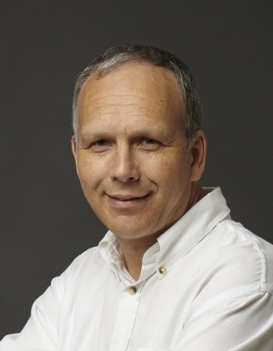
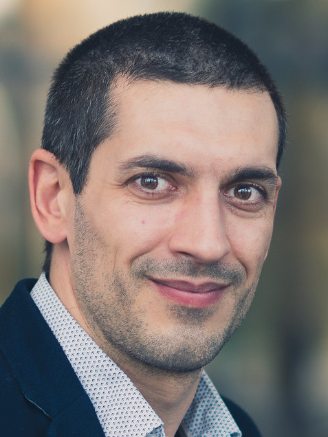
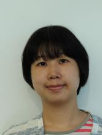

# ERC Team 

The ERC project Video Holography has been executed at [imec](https://www.imec.be) as the host institute. It has been conceived and xx by Prof. Jan Genoe, as the principal investigator. He has been supported a strong team of senior academic staff (see {numref}`staff`) and two PhD students diving deep into the subject of the project (see {numref}`phdstaff`). The project would also not have been possible without the strong support from several other technology experts from the different research units in the host institute [imec](https://www.imec.be).

## Core Team

### Principal Investigator

```{list-table}
:widths: 25 100
:header-rows: 0

*  - 
   - .. latex:vspace::-1cm  
   Prof. Jan Genoe is scientific director at the Host institution imec and has received all support from the Host institution to build the research team and execute the research. Prof. Jan Genoe also takes the scientific leadership of the Video Holography ERC research.
```

### Senior academic staff in the team

```{list-table} Senior academic staff
:widths: 25 100
:header-rows: 0
:name: staff

*  - 
   - Dr. Robert Gehlhaar provides scientific input on the optical stack design and characterization.

*  - 
   - Dr. Zsolt Tokei provides technology input on the realisation of devices in the 300mm cleanroom.

*  - 
   - Prof. Clement Merckling provides scientific input on the material growth conditions for the BTO and STO waveguide materials.

*  - 
   - Prof. Paul Heremans provides scientific input on the device performance.
```

### PhD students

```{list-table} PhD students
:widths: 25 100
:header-rows: 0
:name: phdstaff

*  - 
   - Guillaume Croes is the PhD student elaborating the metamaterial stack and optical model for the optimization for driving the hologram.
    He was awarded a Strategic Basic Research Fellowship from FWO for his PhD


*  - 
   - Tsang-Hsuan Wang is the PhD student elaborating the optimized growth conditions for the BTO and STO waveguide materials.
   
```

## Other contributors

* Diana Tsvetanova provides input on the CMP processes in the 300 mm line.

* Yunlong Li provides input on the process sequence in the 300 mm line.

* Renauld Puybaret is in charge of the daily supervision of the process in the 300 mm line.

* Thomas Raes is in charge of the Mask preparation for the process in the 300 mm line.

* Deniz Sabuncuoglu Tezcan is in charge of the supervision of the process in the 300 mm line.

* Jeremy Segers is in charge of the oxide-oxide bonding process between the BTO wafer and the optical transparent metamaterial.
